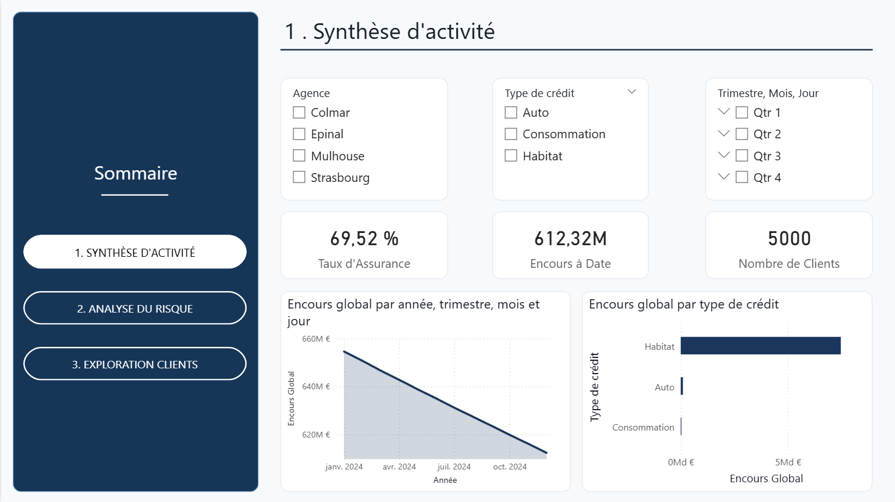
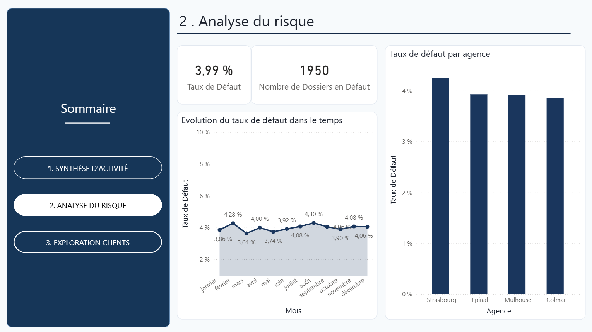
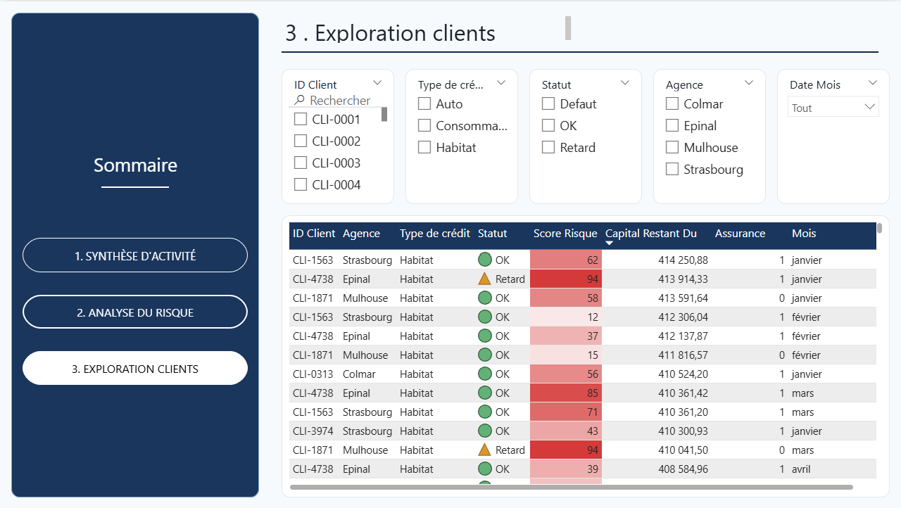

# 🏦 Pilotage de Portefeuille Crédits & Analyse du Risque de Défaut

> **Projet de Business Intelligence : Analyse granulaire d'un portefeuille de 5 000 clients sur 12 mois (60 000 enregistrements).**

---

## 📑 Présentation du Projet
Ce projet simule un environnement bancaire réel pour le pilotage d'une activité de crédit. L'objectif est d'offrir une vision à 360° de l'exposition financière de la banque et d'anticiper la sinistralité (risque de défaut) via un dashboard interactif.

### 🎯 Objectifs Business :
1. **Pilotage de l'Encours :** Suivre l'amortissement du capital restant dû (CRD) mois après mois.
2. **Gestion du Risque :** Identifier les segments de clientèle à risque via une segmentation par score.
3. **Optimisation du Recouvrement :** Analyser les comportements de paiement pour prioriser les actions.

---

## 🛠️ Stack Technique & Méthodologie

* **Génération de Données :** Python (Pandas, Numpy) pour créer un dataset réaliste incluant l'amortissement linéaire et des probabilités de défaut basées sur la loi normale.
* **Modélisation :** Power BI (Schéma en étoile) connectant un référentiel statique (`referentiel_credits`) à une table de faits historisée (`suivi_mensuel_credits`).
* **Analyse :** DAX (Data Analysis Expressions) pour le calcul du Taux de Défaut, de l'Encours à date et de l'évolution mensuelle.

---

## 📊 Aperçu du Dashboard (Screenshots)

### 1. Synthèse d'Activité
*Vision macro du portefeuille : Encours global, répartition par type de prêt et volume de clients.*

### 2. Analyse de la Sinistralité (Risque)
*Analyse du taux de défaut et distribution des scores de risque. Ce visuel permet d'identifier les agences les plus exposées.*

### 3. Exploration Granulaire
*Tableau de bord détaillé permettant une recherche par client et une analyse temporelle des trajectoires de remboursement.*

---

## 🧠 Concepts Bancaires Appliqués
* **EAD (Exposure At Default) :** Utilisation du Capital Restant Dû pour évaluer l'exposition réelle au risque à chaque arrêté mensuel.
* **Time Intelligence :** Comparaison de la performance entre le début et la fin de l'exercice pour valider l'extinction naturelle des créances.
* **Segmentation de Risque :** Mise en place d'alertes visuelles sur les clients dont le score se dégrade.

---

## 🚀 Installation & Utilisation
1. Télécharger le fichier `systeme_core_banking_horizon.pbix`.
2. Ouvrir avec **Power BI Desktop**.
3. Les données sources sont disponibles en format CSV dans le dossier `/data`.

---

**Auteur : Francesca TISNES**
